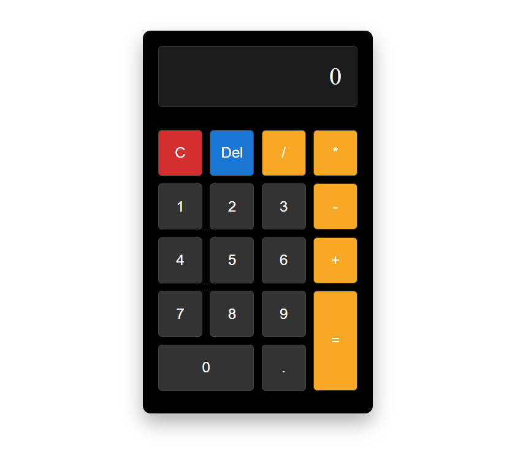

# Calculator Project with JavaScript, HTML, and CSS

This project is a simple calculator built with **JavaScript**, **HTML**, and **CSS**. It allows users to perform basic mathematical operations such as addition, subtraction, multiplication, and division.

## Table of Contents
- [ScreenShot](#screenshot)
- [Features](#features)
- [Prerequisites](#prerequisites)
- [Usage](#usage)

## ScreenShot



<p align="right">(<a href="#table-of-contents">back to top</a>)</p>

### Built With

This project was built using only the following technologies:

* 
* 
* 

<p align="right">(<a href="#table-of-contents">back to top</a>)</p>

## Features

- User-friendly and simple interface
- Supports basic operations (addition, subtraction, multiplication, division)
- Ability to clear input and delete the last digit
- Displays results using the `=` button
- Responsive design using CSS Grid

<p align="right">(<a href="#table-of-contents">back to top</a>)</p>

## Prerequisites

To run this project, all you need is a browser that supports HTML, CSS, and JavaScript. There are no additional libraries or dependencies required.

<p align="right">(<a href="#table-of-contents">back to top</a>)</p>

## Usage

1. Clone the project from GitHub or download the files:
   ```bash
   git clone https://github.com/AmirrezaAhmadi/Calculator-App.git
